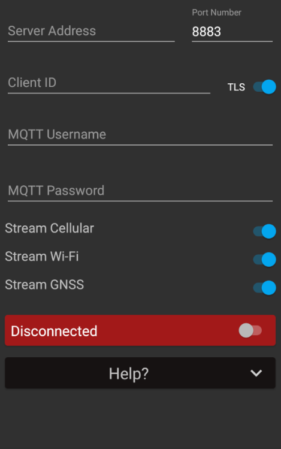

# MQTT Connection Library

## What is it?
The MQTT Connection Library provides a simple connection UI as well as logic to perform an MQTT connection in an Android app. If additional options are needed for the connection (beyond the provided), there is a capability that can be utilized. Please read Development Instructions for more detail.

## How to Use this Library
It is important to note that the pieces provided in the library cannot stand on their own. Most classes are to be extended or implemented, as an "MQTT Connection" relies on a service that drives the logic using the connection. We will go over the correct way to wire everything together below.
1. Ensure that the correct version of the library is included in the consuming project's `build.gradle` file, under its dependencies:<br><br>
   ```
   implementation 'com.craxiom:mqttlibrary:0.7.3'
   ```
2. Next, for the connection UI, the `fragment_mqtt_connection` is readily available under `res/layout`; however, `AConnectionFragment` must still be extended, or `DefaultConnectionFragment`.<br>Note: Users can extend the latter if they do not wish to add extra UI components. Otherwise, extend `AConnectionFragment`, which contains methods marked with "additional" in their names and <i>must</i> be overridden in the child class.<br>
  &ensp; a. Whichever fragment ends up being extended, it will require a binder parameter. This binder should extend the provided `AConnectionFragment#ServiceBinder` in order to be recognized. Likely, this binder will be located in the `IMqttService` implementation of the consuming project.
3. Moving on to the service interface, `IMqttService`: The fragment relies on the service to perform the connection backend logic. For example, if the user toggles the connection switch, the fragment will call `IMqttService#connectToMqttBroker`.
4. The `IMqttService` implementation should ideally include a `DefaultMqttConnection`, which will perform connection/disconnection.
5. Additionally, the `BrokerConnectionInfo` holds relevant information in order to successfully make an MQTT connection. It is important to note that one should extend this class if additional fields are needed and these fields should correspond to the additional fragment UI components, if any.




## Build Instructions
 - Execute `gradlew build` in the root directory to produce the Android AAR library.
 - Execute `gradlew publishDebugPublicationToMavenLocal` in the root directory to publish the debug aar artifact to the local Maven cache.
 - Execute `gradlew publishReleasePublicationToMavenLocal` in the root directory to publish the release aar artifact to the local Maven cache.


## Changelog

See the change log for details about each release: [`CHANGELOG.md`](CHANGELOG.md)

## Contact
* **Eliza Alcaraz** - [eliza-mae-alcaraz](https://github.com/eliza-mae-alcaraz)
* **Christian Rowlands** - [Craxiom](https://github.com/christianrowlands)
